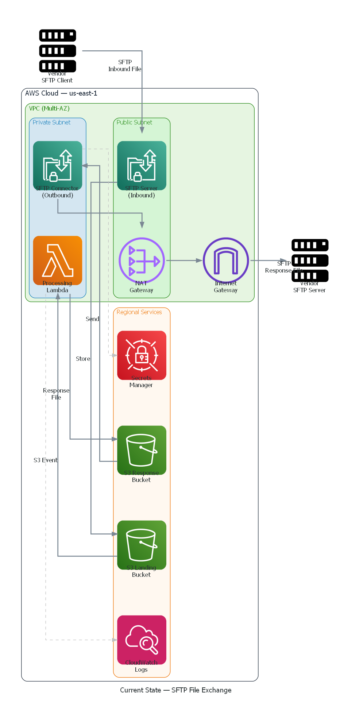
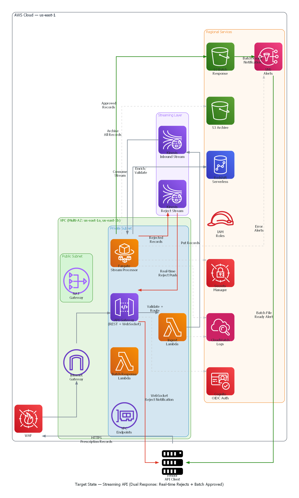

# Streaming Prescription Data API — Proposal

---

## The Current state Today

We currently exchange prescription data with our vendor using **file-based transfers (SFTP)**:

1. Vendor packages **~1 million prescription records** into a single file (**~1 GB**)
2. Vendor uploads the file to our SFTP server
3. We process the entire file (could take minutes to hours)
4. We generate a response file and send it back via SFTP

### Limitations

| Issue | Impact |
|-------|--------|
| **Delayed feedback** | Vendor doesn't know if a record is bad until the entire 1 GB / 1M record file is processed and returned — could be hours |
| **All-or-nothing processing** | One bad record doesn't get flagged until the whole batch completes |
| **No real-time visibility** | Neither side knows the status of records in transit |
| **Manual retry** | If a file fails mid-processing, the vendor must resend the entire 1 GB file |
| **Scaling limitations** | Larger files = longer processing = longer wait times |

---

## What We're Proposing

Replace the batch file exchange with a **real-time streaming API** — records flow in as they're produced, get validated immediately, and responses come back in two ways:

### Dual Response Model

| Response Type | What | When | Why |
|---------------|------|------|-----|
| **Real-time rejects** | Bad records (invalid drug codes, missing data) | Instantly — within seconds | Vendor can fix and resubmit immediately |
| **Batch approved** | Successfully validated records | Hourly summary file | Efficient for downstream systems, audit trail |

### How It Works (Simple View)

CURRENT:
  ### Vendor → [1 GB File / ~1M records] → SFTP → Wait hours → [Response File] → Vendor
PROPOSED:
  ### Vendor → [Record by record] → Streaming API → Validate each one
                                                    ├── Bad?  → Instant reject back to vendor
                                                    └── Good? → Collect into hourly batch → Notify vendor

## Business Benefits

### 1. Faster Error Resolution
- **Before**: Vendor finds out about bad records hours later in a response file
- **After**: Vendor gets rejected records back in **seconds** with the reason — can fix and resubmit immediately

### 2. Reduced Processing Delays
- **Before**: Must wait for entire file to arrive before processing starts
- **After**: Each record is processed as it arrives — no waiting for the full batch

### 3. Better Visibility
- Both sides can see record status in real-time through the API dashboard
- No more "did the file arrive?" phone calls

### 4. Reliability
- Individual record failures don't block other records
- No more resending entire files because of one bad record
- Every record is archived for audit compliance

### 5. Scalability
- System automatically handles volume spikes (e.g., end-of-month surges)
- No file size limitations

---

## What Stays the Same

| Aspect | Change? |
|--------|---------|
| Data content (prescription fields) | **No change** — same data, different delivery method |
| Validation rules | **No change** — same business rules, applied per-record |
| Security & authentication | **Enhanced** — OIDC/JWT auth on every request (vs shared SFTP credentials) |
| Audit trail | **Enhanced** — every record archived individually with timestamps |
| Vendor relationship | **Minimal change** — vendor switches from SFTP client to API client |

---

## Comparison: Current vs Proposed

| | Current (SFTP) | Proposed (Streaming API) |
|---|---|---|
| **Delivery** | Batch file (~1 GB, ~1 million records) | Record-by-record, real-time |
| **Feedback speed** | Hours | Seconds (rejects), Hourly (approved) |
| **Error handling** | Entire file reprocessed | Only bad records flagged |
| **Visibility** | None until response file | Real-time dashboard |
| **Security** | Shared SFTP credentials | Per-user JWT tokens (OIDC) |
| **Retry** | Resend entire 1 GB file | Resubmit individual records |
| **Scalability** | Limited by file size/processing time | Auto-scales with volume |
| **Audit** | File-level logs | Record-level archive with timestamps |

---

## Architecture Overview

- Current SFTP file exchange flow  
  
- Proposed streaming API with dual response
  

### Key AWS Services Used

| Service | Role | Why This Service |
|---------|------|------------------|
| **API Gateway** | Front door for vendor requests | Managed, secure, scalable |
| **Kinesis Data Streams** | Real-time record pipeline | Built for high-throughput streaming |
| **ECS Fargate** | Processes and validates each record | Always-on, no servers to manage |
| **Redshift** | Validates prescriptions (drug codes, eligibility) | Existing database — no new systems |
| **S3** | Stores approved batches + archive | Durable, cost-effective storage |
| **SNS** | Notifies vendor when batch is ready | Push notifications, no polling needed |
| **Cognito** | Authentication (OIDC) | Industry-standard identity management |

---

## Vendor Impact

### What the vendor needs to do

1. **Switch from SFTP client to API client** — send records via HTTPS instead of uploading files
2. **Authenticate with JWT tokens** — more secure than shared SFTP passwords
3. **Handle two response channels**:
   - Listen for real-time reject notifications (fix and resubmit)
   - Poll or subscribe for hourly batch files (approved records)

### What we provide to the vendor

- API documentation and endpoint URLs
- Authentication credentials (Cognito user)
- Sample code / SDK for integration
- Interactive dashboard for testing

---

## Risk & Mitigation

| Risk | Mitigation |
|------|------------|
| Vendor not ready to switch | Run both SFTP and API in parallel during transition |
| Volume spike overwhelms system | Kinesis auto-scales shards; Fargate scales tasks |
| Network interruption | Kinesis retains records for 24 hours; no data loss |
| Validation logic changes | Same rules as today, centralized in one processor |

---

## Proposed Timeline

| Phase | Duration | What |
|-------|----------|------|
| **Phase 1 — Prototype** | 2 weeks | Build and test internally with mock data |
| **Phase 2 — Integration Test** | 2 weeks | Connect to real Redshift data, validate end-to-end |
| **Phase 3 — Vendor Pilot** | 2-4 weeks | Vendor sends test records via API alongside SFTP |
| **Phase 4 — Parallel Run** | 4 weeks | Both SFTP and API active, compare results |
| **Phase 5 — Cutover** | 1 week | Decommission SFTP, API becomes primary |

> **Total estimated timeline: 11-13 weeks**
> SFTP remains active until Phase 5 — zero disruption during transition.

---

## Cost Considerations

| Component | Estimated Monthly Cost | Notes |
|-----------|----------------------|-------|
| Kinesis (2 streams, scaled for ~1M records/day) | ~$30-80 | Scales with volume |
| ECS Fargate (1 task, always-on) | ~$15 | Can scale to 0 when idle |
| API Gateway | ~$5-10 | Pay per request |
| S3 (archive + batches) | ~$5 | Depends on volume |
| SNS notifications | < $1 | Minimal |
| **Total** | **~$75-120/month** | Current SFTP server costs can be retired after cutover |

---

## Next Steps

1. **Review this proposal** with architecture and management teams
2. **Confirm validation rules** — which Redshift tables/checks apply
3. **Align with vendor** on API adoption timeline
4. **Approve Phase 1** — prototype is already built and ready to deploy

---

## Questions?

The prototype is built and ready for demo. Architecture diagrams, working code, and interactive dashboard are all available for review.
